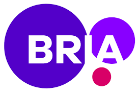

# Bria Demos - GTC-2025
<p align="center">
    
</p>
<!-- <br> -->

Make sure to have all required packages installed:
```
pip install -r requirements.txt
```


## Demo Session 1 - Deploying Visual Gen AI Solutions with Bria's APIs

Requires a BRIA API token through registration: https://go.bria.ai/4bsFO3f (Registration includes first 1000 complimentary API calls)

- [Build visaul Gen-AI tools with Bria's API](gtc_demo_api.ipynb): Core implementation showcasing cloud-based text-to-image generation and production-ready API workflows.
- [Fine-tune a Tailored-Generation model with Bria's API](gtc_demo_fine_tune_api.ipynb): LoRA fine-tuning techniques leveraging our  APIs for efficient model customization


## Demo Session 2 - Training & Running Visual Gen AI On-Prem

Model access requires subscription: https://platform.bria.ai/console/models/access-models

- [Build visaul Gen-AI tools using Bria's model weights](gtc_demo_on_prem.ipynb): Complete implementation for self-hosted deployment within enterprise environments.
- [Fine-tune a Tailored-Generation model with Bria's model weights](gtc_demo_fine_tune_on_prem.ipynb): Advanced model customization for on-premise deployments, optimized for proprietary data and specialized use cases.


<br>

